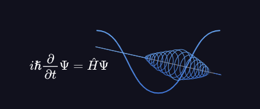

# Quantum Computing Starter

A starter project on quantum computing based on Black Opal Q-Control https://black.q-ctrl.com/skills. We only have access to the first part of each section and the rest of the tutorial is locked behind paywall so we skip those for now and complete the first sections alone.

## Introduction

- Quantum computers are much better at solving certain kinds of problems (like quantum simulations) compared to classical computers
- These use the quantum properties of atoms/molecules and engineered materials to do computations
- Most qunatum devices (2025) require extreme environments like total vacuum and absolute zero temperatures
- Quantum simulations are hard for classical computers
  - as sizes of the quantum system increases, the accuracy of the classical simulation tends to decrease
  - if the size keeps increasing, eventually the classical computer will run out of memory
- Supercomputers spend significant amount of time doing chemical simulations but they don't have as much clarity as we can gain from quantum computers
- Quantum computers aren't meant to be only used on their own and can be paired with classical systems to provide hybrid problem solving capabilities
- Qunatum information is measured in qubits
  - a qubit is defined by two numbers, basically how much 1 is it and how much 0 is it
  - a number in usual computers can be represented by 32 bits generally, so a qubit would require 64 bits
    - this implies that 2 qubits need 128 bits and 3 qubits need 256 bits
    - thus, a qubit can represent exponential amount of information compared to bits
    - for 75 qubits, we need 302 zettabytes (1e9 TB) which is more than the collective data on Earth in 2025 (~180 ZB)
  - we expect to have quantum computers with millions of qubits just like we have classical computers with millions of bits today
  - one qubit can be seen as a sphere with two angles (`θ` - angle with z-axis) and (`Φ` - angle between XY projection and x-axis)

  

- While quantum computers are mostly experimental today, there is potential for use today
- Current research is mainly in:
  - Material and Drug design
  - Transport and Logistics
  - Pricing and risk in financial portfolios
  - Improved training efficiency for AI
- Today's era is called NISQ (Noisy intermediate scale quantum)
  - noise is a disadvantage of quantum computers and that is something we are working to reduce while increasing qubits
  - there have been some calls for quantum advantage but classical computers still have the edge on real-world problems
  - once we hit true quantum advantage, we expect to see exponential rises in quantum computing capabilities compared to classical computers

---

## Superposition

-  Waves occur in the natural world often, and it does even in quantum computing
-  It has three aspects
   -  `Amplitude` is the maximum displacement of the rope from its resting position during the wave propagation
   -  `Wavelength` is the minimum length of the wave before it repeats
   -  They are independent parameters and mean different things based on the medium of the wave
      - for light, low wavelength implies more energy
      - for sound, high amplitude implies more energy
   - two waves can be displaced in space or in time, and this displacement is often referred to as `phase`
 - Two waves that meet dont affect one another but affect the medium they are propagating through simultaneously, called `interference`
  - quantum computing can be thought of coordinating interference to achieve some advantage
  - interference can be constructive or destructive
  - this is also referred to as `superposition` when the two waves interfere and cause a combined outcome
- Modifying the amplitude, phase and wavelength of individual waves to create a resultant wave is an aspect of quantum noise reduction
  - both matter and light also behave as waves at the quantum scale
  - quantum computations are performed in superpositions and undesired outcomes destructively interfere
- Circles have a close mathematical connection with waves
  - uniform motion around a perfect circle creates the perfect wave
    - radius relates to the amplitude
    - angle with positive x-axis relates to the phase
      - angle is often measure in radians where `π/2 radians` is `+90 degrees`
    - speed of motion relates to wavelength
  - superposition of circles creates interesting patterns similar to waves (which isn't a circle at all)
- Waves are essentially oscillatory motion
  - oscillatory motion is the solution to differential equations
  - a quantum computer is a device that solves the `Shrodinger Wave Equation`

  

- In the shrodinger equation:
  - `i = square root of -1` is the complex number iota
  - `ħ = 6.62607015 × 10-34 m2 kg / s` is the Plank's constant
  - `t` is the time
  - `Ψ` is the quantum wavefunction whose partial derivative is taken with respect to time
  - `Ĥ` is the energy operator
- Adding two solutions here together produces another solution, which is how superposition works for quantum computers

---
