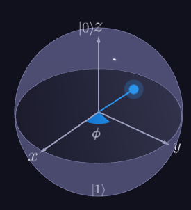

# Quantum Computing Starter

A starter project on quantum computing based on Black Opal Q-Control https://black.q-ctrl.com/skills. We only have access to the first part of each section and the rest of the tutorial is locked behind paywall so we skip those for now and complete the first sections alone.

## Quantum computing introduction

- Quantum computers are much better at solving certain kinds of problems (like quantum simulations) compared to classical computers
- These use the quantum properties of atoms/molecules and engineered materials to do computations
- Most qunatum devices (2025) require extreme environments like total vacuum and absolute zero temperatures
- Quantum simulations are hard for classical computers
  - as sizes of the quantum system increases, the accuracy of the classical simulation tends to decrease
  - if the size keeps increasing, eventually the classical computer will run out of memory
- Supercomputers spend significant amount of time doing chemical simulations but they don't have as much clarity as we can gain from quantum computers
- Quantum computers aren't meant to be only used on their own and can be paired with classical systems to provide hybrid problem solving capabilities
- Qunatum information is measured in qubits
  - a qubit is defined by two numbers, basically how much 1 is it and how much 0 is it
  - a number in usual computers can be represented by 32 bits generally, so a qubit would require 64 bits
    - this implies that 2 qubits need 128 bits and 3 qubits need 256 bits
    - thus, a qubit can represent exponential amount of information compared to bits
    - for 75 qubits, we need 302 zettabytes (1e9 TB) which is more than the collective data on Earth in 2025 (~180 ZB)
  - we expect to have quantum computers with millions of qubits just like we have classical computers with millions of bits today
  - one qubit can be seen as a sphere with two angles (θ - angle with z-axis) and (Φ - angle between XY projection and x-axis)

  

- While quantum computers are mostly experimental today, there is potential for use today
- Current research is mainly in:
  - Material and Drug design
  - Transport and Logistics
  - Pricing and risk in financial portfolios
  - Improved training efficiency for AI
- Today's era is called NISQ (Noisy intermediate scale quantum)
  - noise is a disadvantage of quantum computers and that is something we are working to reduce while increasing qubits
  - there have been some calls for quantum advantage but classical computers still have the edge on real-world problems
  - once we hit true quantum advantage, we expect to see exponential rises in quantum computing capabilities compared to classical computers

---
