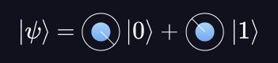
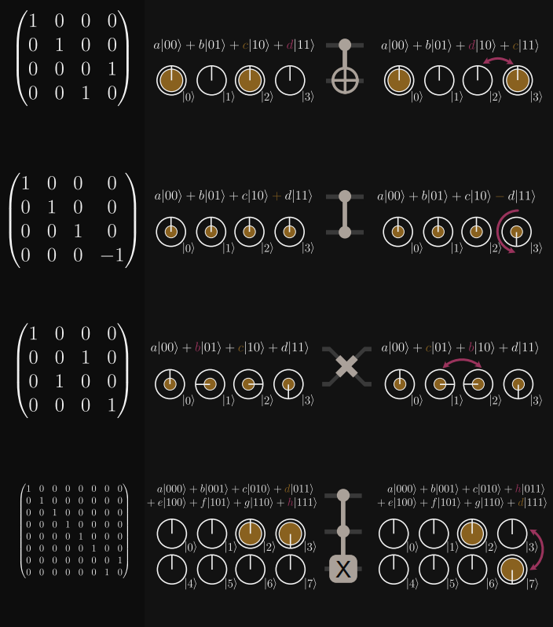
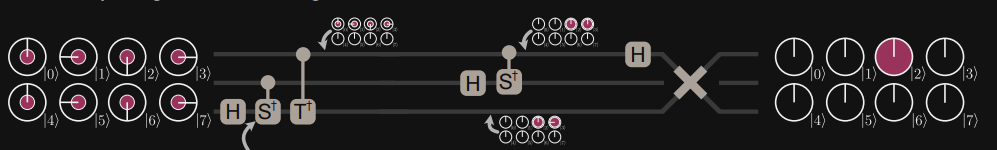
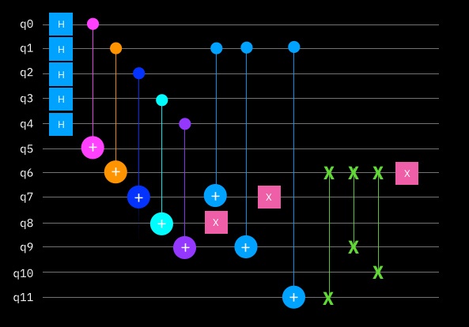

# Quantum Computing Starter

A starter project on quantum computing based on Black Opal Q-Control https://black.q-ctrl.com/skills. We only have access to the first part of each section and the rest of the tutorial is locked behind paywall so we skip those for now and complete the first sections alone.

## Introduction

- Quantum computers are much better at solving certain kinds of problems (like quantum simulations) compared to classical computers
- These use the quantum properties of atoms/molecules and engineered materials to do computations
- Most qunatum devices (2025) require extreme environments like total vacuum and absolute zero temperatures
- Quantum simulations are hard for classical computers
  - as sizes of the quantum system increases, the accuracy of the classical simulation tends to decrease
  - if the size keeps increasing, eventually the classical computer will run out of memory
- Supercomputers spend significant amount of time doing chemical simulations but they don't have as much clarity as we can gain from quantum computers
- Quantum computers aren't meant to be only used on their own and can be paired with classical systems to provide hybrid problem solving capabilities
- Qunatum information is measured in qubits
  - a qubit is defined by two numbers, basically how much 1 is it and how much 0 is it
  - a number in usual computers can be represented by 32 bits generally, so a qubit would require 64 bits
    - this implies that 2 qubits need 128 bits and 3 qubits need 256 bits
    - thus, a qubit can represent exponential amount of information compared to bits
    - for 75 qubits, we need 302 zettabytes (1e9 TB) which is more than the collective data on Earth in 2025 (~180 ZB)
  - we expect to have quantum computers with millions of qubits just like we have classical computers with millions of bits today
  - one qubit can be seen as a sphere with two angles (`θ` - angle with z-axis) and (`Φ` - angle between XY projection and x-axis)
    - this sphere is also called the `Bloch sphere`

<p align="center">
  
</p>

- While quantum computers are mostly experimental today, there is potential for use today
- Current research is mainly in:
  - Material and Drug design
  - Transport and Logistics
  - Pricing and risk in financial portfolios
  - Improved training efficiency for AI
- Today's era is called NISQ (Noisy intermediate scale quantum)
  - noise is a disadvantage of quantum computers and that is something we are working to reduce while increasing qubits
  - there have been some calls for quantum advantage but classical computers still have the edge on real-world problems
  - once we hit true quantum advantage, we expect to see exponential rises in quantum computing capabilities compared to classical computers

---

## Superposition

-  Waves occur in the natural world often, and it does even in quantum computing
-  It has three aspects
   -  `Amplitude` is the maximum displacement of the rope from its resting position during the wave propagation
   -  `Wavelength` is the minimum length of the wave before it repeats
   -  They are independent parameters and mean different things based on the medium of the wave
      - for light, low wavelength implies more energy
      - for sound, high amplitude implies more energy
   - two waves can be displaced in space or in time, and this displacement is often referred to as `phase`
 - Two waves that meet dont affect one another but affect the medium they are propagating through simultaneously, called `interference`
  - quantum computing can be thought of coordinating interference to achieve some advantage
  - interference can be constructive or destructive
  - this is also referred to as `superposition` when the two waves interfere and cause a combined outcome
- Modifying the amplitude, phase and wavelength of individual waves to create a resultant wave is an aspect of quantum noise reduction
  - both matter and light also behave as waves at the quantum scale
  - quantum computations are performed in superpositions and undesired outcomes destructively interfere
- Circles have a close mathematical connection with waves
  - uniform motion around a perfect circle creates the perfect wave
    - radius relates to the amplitude
    - angle with positive x-axis relates to the phase
      - angle is often measure in radians where `π/2 radians` is `+90 degrees`
    - speed of motion relates to wavelength
  - superposition of circles creates interesting patterns similar to waves (which isn't a circle at all)
- Waves are essentially oscillatory motion
  - oscillatory motion is the solution to differential equations
  - a quantum computer is a device that solves the `Shrodinger Wave Equation`

<p align="center">
  
</p>

- In the shrodinger equation:
  - `i = square root of -1` is the complex number iota
  - `ħ = 6.62607015 × 10-34 m2 kg / s` is the Plank's constant
  - `t` is the time
  - `Ψ` is the quantum wavefunction whose partial derivative is taken with respect to time
  - `Ĥ` is the energy operator
- Adding two solutions here together produces another solution, which is how superposition works for quantum computers

---

## Qubits

- Compute is done using data which can be created/stored/transfered/computed/deleted
  - quantum computers find create/store/delete challenging so we can find advantages in transfer/compute
- Data can be analog (continuous real numbers), digital (discrete integers) and quantum (complex numbers)
  - binary is a special case of digital represented by 0 or 1
- Analog data has infinite detail but cannot all be stored whereas digital details have some loss associated with it
  - quantum data can faithfully represent the real world without loss (and can be protected against error)
- Quantum data is single use because it cannot be copied, once read, it collapses
  - this is due to `The Heisenberg Uncertainity Principle`
- The process of changing physical things into configurations representing data is called `encoding`
  - this is done today (2025) in quantum computers using:
    - trapped ions
    - neutral atoms
    - superconducting circuits
    - photonic circuits
    - defects in crystal structures
- Once we have encoded data, we can do computations on it using a sequence of simple functions (logic gates)
  - each logic gate (AND/OR/NOT) can be combined into logic circuits to achieve any algorithm
  - the NAND gate is universal in the sense that any algorithm can be created using only NAND gates
  - quantum computations can be visualized as circuits as well but the gates (and their symbols) are different
  - digital logic gates are non-reversible but can be made so by feeding output to input
  - quantum gates must be reversible
- A fair coin is such that heads and tails have 50% chance each
  - an unfair coin is such that the chances are different but they sum up to 100%
  - a probabilistic bit is similar to the unfair coin where `h + t = 1` (h and t are real numbers)
  - a qubit is similar to probabilistic bit but uses two complex numbers instead of real numbers
  - the qubit holds to `α^2 + β^2 = 1` which is similar to the equation of a circle
  - when `α = β`, then superposition occurs

---

## Measurement

- Like at the end of a classical computation we read bits, in quantum computations we measure qubits
- Qubits cannot be read like regular bits, an attempt to read them gives a classical result
  - also due to `The Heisenberg Uncertainity Principle`
- A qubit is represented as two angles on the Bloch sphere, conventionally the north and south pole
  - a qubit state before measurement can be any point on that sphere (represented by the two angles)
    - these are often called superposition states
  - when a qubit is measured, the poles are the only possible results of the measurement
  - these results are specified as `|0⟩` and `|1⟩` which are the north and south pole respectively
    - these are often called the collapsed state
- Quantum computations are carried out on the qubit with smooth rotations but the collapse of the state when measured is discontinuous and happens instantly
  - the measurement generally happens at the end of the algorithm
  - wen measuring, only `θ` is important so on the equator, there is equal chance of collapsing to either state
  - probability of collapsing to the north pole = `cos(θ/2)^2`
  - `Φ` becomes important during computations
- Quantum gates:
  - `H (Hadamard)` gate creates a superposition state of equal probability (somewhere on equator) given a collapsed state
    - usually from +Z-axis to +X-axis and vice versa
  - `X Pauli` gate rotates 180 degrees around x-axis (flips the qubit)
  - `Y Pauli` gate rotates 180 degrees around Y axis
  - `Z Pauli` gate rotates 180 degrees around Z-axis
  - `Measurement` gate measures the information in the qubit and results in a collapsed state
- In quantum computing, a single qubit releases very little information
  - moreover, it probably doesnt have many superpositions to yield useful information
  - but we can repeat the process multiple times to estimate the state from multiple individual experiments
  - collapse can happen to either state but multiple times can show the corresponding probabilities
  - the process of predicting the qubit state before measurement is called `tomography`
- Generally, we can read the data from classical systems whenever but we cannot in quantum systems
  - at first look, this is random, but intelligent algorithms can be fairly deterministic
  - For example, `HZH` gate will deterministically take an input qubit and collapse to `|1⟩`
- However, quantum algorithms are never fully deterministic and the solution is probabilistic
  - assume we have to find a marked item in a list of N unsorted items, classically `O(N)`
  - probability of guessing the right item is `1/8`
  - quantum algorithms can be constructed to boost the success probability by repeatedly measuring at the right time
  - this quantum search algorithm is called `Grover's algorithm` with complexity of `O(sqrt(N))`

---

## Quantum circuits

- Gates are the most primitive instruction for a quantum computer
  - they can change the state of qubits
- A sequence of gates form an algorithm visualized as quantum circuits
- Following are few important gates:
  - `Hadamard`, `Pauli X`, `Pauli Y`, `Pauli Z`
  - there is the `S` and `T` gates where `SS = Z` and `TT = S`
  - there is also the inverse of `S` and `T` gates which just rotate in the opposite direction
  - more at `https://cdn.prod.website-files.com/6523f13a748909d3e1bbb657/65eb1e3e5c02be8b3520ae32_IQM-Cheat-Sheet-for-Circuit-Magicians.pdf`
- Single qubit quantum operations can be modeled using vectors
  - a single qubit `Q = [[a][b]]`
    - `a` and `b` are the amplitudes of the `|0⟩` and `|1⟩` states respectively
  - each operation is a matrix of 2 rows and 2 columns
    - `X = [[0 1][1 0]]`
    - `Y = [[0 -1][i 0]]`
    - `Z = [[1 0][0 -1]]`
    - `S = [[1 0][0 i]]`
    - `H = (1/sqrt(2))*S`
    - `T = [[1 0][0 e^(iπ/4)]]`
  - Applying a gate is like matrix multiplication such `XQ = Q'`
- Gates are assumed to be instantaneous but are actually carried out physically over time
  - in the quantum circuit, when there is no gate and only blank line, its the `identity` operation
  - it implies, do nothing and retain current state
- `Blochers` (circle notation) are another way to visualize qubits
  - two blochers are required to represent one qubit
  - Each blocher is shown as 2 concentric circles
    - outer circle is amplitude = 1
    - inner circle is amplitude of a pure state `|0⟩` or `|1⟩`
    - each pure state has its own blocher showing its amplitude
    - there is also an angle relative to +X axis from center to surface representing the `phase`
      - its the `Φ` angle between XY projection and x-axis on the Bloch sphere
  - A Bloch sphere stops working for more than one qubit whereas blochers still work
  - The quantum state of a system can be defined by an arrangement of these circle notations

<p align="center">
  
</p>

- Circle notations can help with multi-qubit systems
- The number of computational states doubles with each new qubit
  - `|00⟩, |01⟩, |10⟩ and |11⟩` are the possible states of a two qubit system
  - `|Ψ⟩ = a|00⟩ + b|01⟩ + c|10⟩ + d|11⟩` is the resultant state and this forms a register
- Multi-qubit gates
  - these have control qubits and target qubits represented as a column vector with all computational state coefficients
  - `CNOT or CX` applies the `Pauli X` gate on the target qubit if the control qubit is `|1⟩`
    - matrix version is `[[1 0 0 0][0 1 0 0][0 0 0 1][0 0 1 0]]`
  - `CZ` applies the `Pauli Z` gate on the target qubit if the control qubit is `|1⟩`
    - matrix version is `[[1 0 0 0][0 1 0 0][0 1 0 0][0 0 0 -1]]`
  - `SWAP` swaps the state of two qubits and can be implemented using 3 alternating CNOTs
    - matrix version is `[[1 0 0 0][0 0 1 0][0 1 0 0][0 0 0 1]]`
  - `Toffoli` is a 3-qubit gate with 2 control qubits and 1 target qubit
    - it applies the `Pauli X` gate to the target qubit if both control qubits are in `|1⟩` state
    - this is something like the classical version of an AND gate

<p align="left">
  
</p>

---

### Self notation for easier writing

<p align="left">
  
</p>

- Assume we had the above quantum circuit to represent with an easy-to-type language

```typescript
function qfunc(q: QubitList) { // q is the list of all qubits
    q3.H();
    q3.Sdag(q2); // Sdag is the conjugate of the transpose of S (general S is not multi-qubit though)
    q3.Tdag(q1); // Tdag is the conjugate of the transpose of T (general T is not multi-qubit though)
    q2.H();
    q2.Sdag(q1); // the control qubits are the parameters and the target qubits are the calling qubits, both in same order
    q1.H();
    Swap(q1,q3); // Swap works on 2 qubits and updates them by reference in swapped order
}
```

<p align="center">
  
</p>

- Assume we had the above quantum circuit to represent with an easy-to-type language
- The depth of a quantum circuit corresponds to a circuit's complexity and its total execution time
  - it is measured as the maximum number of operations required when all parallelizable qubit operations are parallelized in a left-to-right manner while no qubit can simultaneously support read and write
  - the below pseudocode shows how and why `depth = 9`

```typescript
function qfunc(q: QubitList) {
    for (i in 0 to 4) {
        qi.H(); // start of L1
    }
    for (i in 0 to 4) {
        q[i + 5].CX(qi); // start of L2 as the qi cannot be used while being updated in L1
    }
    q7.CX(q1); // start of L3 as it needs the update in q1 as part of L2
    q8.X();
    q9.CX(q1); // start of L4 as it needs to access q1 and cannot do so at same time as in L3
    q7.X();
    q11.CX(q1); // start of L5 as it needs to access q1 and cannot do so at same time as in L4
    Swap(q6,q11); // start of L6 as it needs the update of q11 from L5
    Swap(q6,q9); // start of L7 as it needs the update of q6 from L6
    Swap(q6,q10); // start of L8 as it needs the update of q6 from L7
    q6.X(); // start of L9 as it needs the update of q6 from L8
}
```

---

## Entanglement

- Entanglement can be described as two qubits behaving the same way 
  - this is observed even while being separated by significant distances
  - classical information cannot be entangled
  - when superpositions collapse, we expect to find classical correlations
  - this is an extremely fragile state to maintain which can collapse more easily than superposition
  - value of neither qubit is known before measurement
  - value of one qubit can be inferred based on the meeasured value of the second qubit
  - it can be realised using an `H` gate and a `CX` gate as shown

```typescript
// implementation
function E(q0: Qubit) {
    q0.H();
    this.CX(q0);
}

// usage is like entangle q1 using q0 where q0 is the control qubit for the CX gate
q1.E(q0);
```

- Entanglement has promise in quantum network security as well
  - once two qubits are entangled, no other qubits can be entangled into this system
  - so if a sender and receiver are entangled, no other entity can correlate with the data being sent
- Entaglement doesn't seem to have a causal relationship that can determine why it happened
- In entanglement, no actual information is sent between the qubits
  - both qubits just happen to evolve the same way with time until either one collapses
  - technically, the changes in each may coincide faster than light can travel between them
    - to prove that this though, we'd have to measure the qubit faster than light can travel between them
  - moreover, we cannot use this for faster than light communication directly for following reasons
    - measuring the qubit collapses the entanglement which cannot contain much information

---
